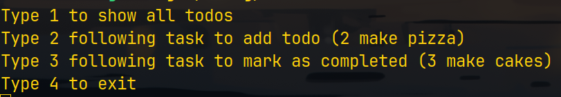

# Rust Todo App

## Overview

This Rust Todo App is a simple command-line application built using the Rust programming language. It allows users to manage their tasks through basic commands, providing a straightforward way to add, remove, and list tasks.

## Features

- Add tasks
- Mark tasks as completed
- List all tasks

## Prerequisites

Before you begin, ensure you have Rust and Cargo installed on your machine. If not, you can install them from [Rust's official website](https://www.rust-lang.org/).

## Installation

1. Clone the repository:

   ```sh
   git clone https://github.com/badonix/rust_todo.git
   ```

2. Go in projects directory
   ```sh
   cd rust_todo
   ```

3. Run the project using Cargo:

    ```sh
    cargo run
    ```

## Build

1. To build project simple run:

    ```sh
    cargo build
    ```
and executable will be found at `/target/debug/rs_list.exe`

